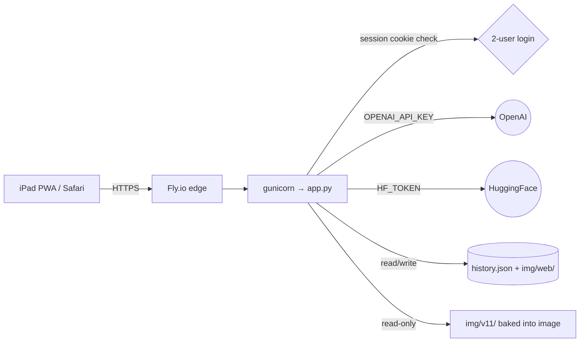

# Fly.io Deploy + iPad PWA — Speak Storyboard

## Implementer guidance

- Implementation runs in **Sonnet** after this plan is approved.
- After each phase: (1) summary of changes, (2) list of files modified, (3) stop and wait for approval before continuing.
- All API keys live in **Fly secrets** server-side. Nothing client-side. Local `.env` is the dev-side mirror; both are git-ignored.
- No new auth provider, no OAuth, no magic links, no email, no MFA, no password reset.
- Keep diffs small. Reuse the existing single-file Flask app. **Do not refactor** `storyboard_planner_minimal.py` or `gen_image_minimal.py`. Treat `app.py` and `speak_in_pictures_demo.html` as the only files we touch.
- Prefer terminal-based Fly deploys. If a step requires the dashboard (rare — usually just verifying a value), the plan will say so explicitly.

## Architecture (target, end state)



## Hard guardrails for every phase

- **Never** modify `storyboard_planner_minimal.py` or `gen_image_minimal.py`.
- **Never** call OpenAI or HuggingFace from implementation steps. The user runs smoke tests manually.
- **Never** commit `.env`, `.users.json`, or any file containing secrets. (`*.env` and `.users.json` will be added to `.gitignore` if not already covered.)
- **Never** start a long-running dev server in implementation. Plan stops, user runs commands.
- New deps must be justified and pinned with a floor. We add exactly two: `gunicorn` and `python-dotenv` (the latter is *already imported* in `app.py` but missing from `requirements.txt` — that's a latent bug we fix in Phase 1).
- Each phase must work even if subsequent phases are never shipped.

## Assumptions baked in (please confirm or correct before approval)

1. **"Private" means "public URL gated by login,"** not Fly private networking (which would block iPad over cellular). If you actually want WireGuard / Flycast / IP-allowlist, the plan changes — say so now.
2. **Region**: default to `iad` (US East). Pick a closer region if your iPad will be elsewhere. Single region, single machine, smallest size (`shared-cpu-1x@256mb` — confirm fits; FLUX-schnell calls are remote so no GPU needed).
3. **Fly org**: deploy to your **personal** org. If you want a team org, specify.
4. **App name**: `speak-storyboard-<random6>` so the URL isn't guessable. You can override.
5. **Auto-stop**: machines stop when idle (saves money), wake on first request (~3-5 s cold start). Acceptable for two-user testing.
6. **Persistence**: ephemeral by default. Phase 4 (optional) adds a 1 GiB volume if you want generated images to survive redeploys.
7. **HTTPS**: Fly provides this for free on the `*.fly.dev` hostname. No custom domain in scope.

## Optimization priorities (per your request)

1. Speed
2. Simplicity
3. Low risk
4. Minimal code churn
5. Easy iteration

## Phase 1 — Containerize + deploy to Fly.io

**Goal**: a real `https://<app>.fly.dev/` URL that loads the existing page and serves the v11 seed images. No auth yet, no PWA yet. Validates the Docker + Fly + secret-wiring path **before** we layer anything else on.

**Why first**: Docker + Fly is the highest-variance step. If anything is going to misbehave (missing dep, wrong port, missing seed image, wrong WSGI invocation), I want to debug it in isolation, not tangled with auth or manifest changes.

### Files created

- `Dockerfile` — Python 3.12-slim, copy app + assets, install deps, run gunicorn on `:8080`.
- `fly.toml` — single machine, smallest size, internal port `8080`, `auto_stop_machines = "stop"`, `min_machines_running = 0`.
- `.dockerignore` — exclude `.venv/`, `__pycache__/`, `.git/`, `videos/`, `.env`, `*.md` *except* the service prompts, `implementation_plans/`. **Do not exclude** `img/v11/*.png` — those are baked into the image as seed data.

### Files updated

- `requirements.txt` — add `gunicorn>=21.0.0` and `python-dotenv>=1.0.0` (the latter is already imported by `app.py` line 22).
- `app.py` — **one** small change: read host/port from env (`PORT`, default `8080`) only inside the `__main__` block. Production path uses gunicorn directly, untouched. Estimated diff: ~3 lines.

### Files NOT touched

- `speak_in_pictures_demo.html`, `storyboard_planner_minimal.py`, `gen_image_minimal.py`, any JSON, any prompt file.

### Fly secrets set in this phase

```
OPENAI_API_KEY = <user-provided>
HF_TOKEN       = <user-provided>
```

### Fly.io deployment commands (terminal, no dashboard needed)

```powershell
# One-time, from project root:
fly auth login                              # opens browser; sign in once

fly launch --no-deploy --copy-config `
  --name speak-storyboard-<random6> `
  --region iad `
  --org personal `
  --vm-memory 256

# Set production secrets (values from your local .env):
fly secrets set `
  OPENAI_API_KEY=$env:OPENAI_API_KEY `
  HF_TOKEN=$env:HF_TOKEN

fly deploy

fly status
fly logs                                    # tail to watch first request
```

If `fly launch` insists on building or asks interactive questions, we'll use `fly launch --no-deploy --copy-config` (which preserves our hand-written `fly.toml` and `Dockerfile`) and answer `no` to scaling/postgres/redis prompts.

### Local test instructions (before deploying)

```powershell
# Build and run the same container locally:
docker build -t speak-storyboard:dev .
docker run --rm -p 8080:8080 `
  -e OPENAI_API_KEY=$env:OPENAI_API_KEY `
  -e HF_TOKEN=$env:HF_TOKEN `
  speak-storyboard:dev

# Visit http://127.0.0.1:8080 — the existing page should load
# and /api/history should return the 3 seeded items.
```

If you don't have Docker locally, this step can be skipped — Fly's remote builder will build for you. Note this as a fallback in the implementation, not a blocker.

### Manual checks (the user does these)

1. `curl https://<app>.fly.dev/` returns the HTML body.
2. `curl https://<app>.fly.dev/api/history` returns 3 seed items.
3. Visit the URL in a browser, click a history chip → image renders.
4. Type a new prompt, click *Make Storyboard*, image generates (this validates secrets work).
5. `fly logs` shows no errors.

### Rollback for Phase 1

- **Fast rollback**: `fly apps destroy <app-name>` — nukes the deployment. Local code is unchanged in source control unless committed; if committed, `git revert <phase1-commit>` removes the Dockerfile/fly.toml/requirements bump.
- **Partial rollback**: `fly deploy --image <previous-image-ref>` if a future deploy regresses. (Image refs from `fly releases`.)

### Risks & mitigations

- **`img/v11/*.png` missing from image** — mitigated by explicit `.dockerignore` rules and a verification step: `docker run --rm speak-storyboard:dev ls /app/img/v11 | wc -l` should print > 0.
- **Cold start > 30 s** — mitigated by tiny image (slim base, no compile-heavy deps), `min_machines_running = 0` accepted as a trade-off for cost.
- **`gunicorn` worker timeout on image generation** — set `--timeout 120` (FLUX-schnell at 4 steps is ~5-15 s; OpenAI plan ~3-8 s; total budget 30-60 s typical).
- **URL is publicly reachable until Phase 2 ships** — mitigated by random app name. If you want zero exposure, see "Alternative phasing" below.

---

## Phase 2 — Flask-session auth gate (2 users, env-driven creds)

**Goal**: the app is reachable only to someone who logs in with one of two hardcoded username/password pairs. Sessions live in a signed cookie. Logout works. That's it.

### Design

- Existing routes (`/`, `/api/history`, `/api/generate`, `/img/<path>`) get a tiny `@login_required` decorator. Static manifest/icons (Phase 3) are *unauthenticated* so the manifest can load on the login page itself.
- New route `GET /login` serves a tiny inline HTML form (no Jinja template file — keep it inline in `app.py` as a string, 20-30 lines).
- New route `POST /login` validates against `AUTH_USER_1/AUTH_PASS_1` and `AUTH_USER_2/AUTH_PASS_2` using `hmac.compare_digest` (constant-time; no bcrypt/argon2 needed since passwords are intentionally simple per the brief).
- New route `POST /logout` clears `session["user"]` and redirects to `/login`.
- `app.secret_key` = `os.environ["APP_SECRET_KEY"]` (Fly secret; 32+ random bytes hex). If missing, app refuses to start with a clear error.
- Cookie flags: `Secure=True`, `HttpOnly=True`, `SameSite="Lax"`, `Permanent=True`, lifetime 30 days (so iPad doesn't re-auth daily).

### Files updated

- `app.py` — add ~60-80 lines: imports (`session`, `redirect`, `url_for`, `hmac`, `functools.wraps`), decorator, login/logout routes, inline login HTML, secret-key load. Decorator added to existing routes.
- `.env` — local additions (you fill in the real values; placeholders shown):
  ```
  APP_SECRET_KEY=<run: python -c "import secrets; print(secrets.token_hex(32))">
  AUTH_USER_1=<email-or-username-1>
  AUTH_PASS_1=<simple-password-1>
  AUTH_USER_2=<email-or-username-2>
  AUTH_PASS_2=<simple-password-2>
  ```
- `.gitignore` — verify `.env` is covered (it is). Add `.users.json` defensively even though we won't create one.

### Files NOT touched

- `speak_in_pictures_demo.html` — login is a separate page; the demo page itself stays untouched. Logout button is **not** added to the demo HTML in this phase (avoid UI churn). Users log out by visiting `/logout` directly. Phase 3 may add a tiny logout link if you want.
- Both Python modules. All JSON.

### Fly secrets added in this phase

```powershell
fly secrets set `
  APP_SECRET_KEY=$(python -c "import secrets; print(secrets.token_hex(32))") `
  AUTH_USER_1="<email1>" AUTH_PASS_1="<simple-pass-1>" `
  AUTH_USER_2="<email2>" AUTH_PASS_2="<simple-pass-2>"

fly deploy
```

You provide the two emails/usernames when this phase is ready to implement.

### Local test instructions

```powershell
# Add the five new vars to .env, then:
.\install.ps1
.\.venv\Scripts\Activate.ps1
python app.py

# Visit http://127.0.0.1:5000/ → redirect to /login
# Enter wrong creds → "Invalid credentials"
# Enter correct creds → original page loads
# Visit /logout → back to /login
```

### Manual checks on Fly

1. `https://<app>.fly.dev/` → 302 to `/login`.
2. `https://<app>.fly.dev/api/history` (no cookie) → 302 to `/login` (or 401 JSON for API requests — we'll pick one consistent behavior; default 302 for simplicity).
3. Log in as User 1 in Safari → page loads, history works, generation works.
4. Close tab, reopen → still logged in (30-day session).
5. `/logout` clears the session.

### Rollback for Phase 2

- **Fast rollback**: `fly deploy --image <pre-phase2-image-ref>` (image refs visible via `fly releases`).
- **Source rollback**: `git revert <phase2-commit>`; re-deploy.
- **No data loss possible** — this phase touches no persisted state.

### Risks & mitigations

- **Session cookie not sticky on iPad PWA** — `SameSite=Lax` + `Secure` + cookies allowed in standalone mode handles this. We do NOT use `SameSite=None`.
- **Lockout from typo** — log in as User 2 from another browser. Or `fly ssh console` and rotate the secret. Document both in this section of the plan.
- **Plain-text password leakage in logs** — gunicorn does not log POST bodies by default; we keep it that way. No `print(request.form)` in the implementation.

---

## Phase 3 — Lightweight PWA + iPad polish

**Goal**: from Safari on iPad, "Add to Home Screen" creates a standalone-launching icon. No service worker, no offline mode, no caching strategy. The simplest spec-compliant manifest plus a couple of meta tags.

### Files created

- `static/manifest.json` — name, short_name, start_url=`/`, display=`standalone`, theme_color matching the page background (`#1a1510`), background_color same, icons array referencing two PNGs.
- `static/icon-192.png` and `static/icon-512.png` — generated once with a 10-line Pillow script (Pillow is already a dep). Solid background + initials "SP" centered. The implementer commits the two PNGs; the script is one-shot and not kept.
- `static/apple-touch-icon.png` — 180×180, same source.

(Implementation note: alternatively, the user supplies icons — if they have brand art, they should drop them in `static/` before Phase 3 implementation and we'll skip the Pillow step.)

### Files updated

- `app.py` — one tiny change: enable Flask's static serving by setting `static_folder='static'` (currently `static_folder=None`). That single change exposes `/static/<path>`. No new routes. The login HTML and demo HTML both get a `<link rel="manifest" href="/static/manifest.json">` and apple-touch meta tags.
- `speak_in_pictures_demo.html` — add **only inside `<head>`**, ~5 lines:
  ```html
  <link rel="manifest" href="/static/manifest.json" />
  <link rel="apple-touch-icon" href="/static/apple-touch-icon.png" />
  <meta name="apple-mobile-web-app-capable" content="yes" />
  <meta name="apple-mobile-web-app-status-bar-style" content="black-translucent" />
  <meta name="theme-color" content="#1a1510" />
  ```
- Update the inline login HTML in `app.py` with the same five `<head>` lines.

### Files NOT touched

- All Python modules. No JS changes. No CSS changes. No service worker.

### iPad "Add to Home Screen" instructions

1. Open Safari on iPad.
2. Visit `https://<app>.fly.dev/` and log in.
3. Tap the **Share** icon (square with up arrow) in the toolbar.
4. Scroll and tap **Add to Home Screen**.
5. Optionally rename it; tap **Add**.
6. Launch from the home screen — it opens in standalone mode (no Safari chrome).
7. First launch will redirect to `/login` if the cookie has expired; otherwise it goes straight to the app.

### Rollback for Phase 3

- **Fast rollback**: `fly deploy --image <pre-phase3-image-ref>`. The PWA bits are purely additive — removing them does not affect the home-screen icon already saved on the iPad (it just stops being standalone-styled).
- **Source rollback**: `git revert <phase3-commit>`.

### Risks & mitigations

- **Icon ugliness** — placeholder icons are intentionally minimal. Replacing them is a 1-commit, 2-file change later. Not blocking.
- **`apple-mobile-web-app-capable` is deprecated** — yes, in favor of the manifest's `display: standalone`. We include both because iPadOS still respects the old meta tag on first-add. Belt + suspenders.

---

## Phase 4 (optional) — Fly volume for runtime persistence

**Goal**: `history.json` and generated `img/web/*.png` survive machine restarts and redeploys. Skip this phase if you're fine losing generated content between deploys.

### Files updated

- `fly.toml` — add `[mounts]` block: `source = "speak_data"`, `destination = "/data"`.
- `app.py` — read `HISTORY_PATH` and `WEB_IMG_DIR` from env, defaulting to current paths. Estimated diff: ~6 lines.
- (Fly secrets) `HISTORY_PATH=/data/history.json`, `WEB_IMG_DIR=/data/web` set once.

### Commands

```powershell
fly volumes create speak_data --region iad --size 1
# Edit fly.toml to add the [mounts] block, edit app.py, then:
fly secrets set HISTORY_PATH=/data/history.json WEB_IMG_DIR=/data/web
fly deploy
```

### Rollback for Phase 4

- **Fast rollback**: revert env vars (`fly secrets unset HISTORY_PATH WEB_IMG_DIR`) — paths fall back to in-image defaults. Volume stays but is unused.
- **Full removal**: `fly volumes destroy speak_data` after rolling back.
- Note: detaching a volume from a running machine requires the machine to restart, so plan for ~10 s of downtime.

### Risks & mitigations

- **Volume only attaches to one machine** — fine for our `min_machines_running = 0`, single-machine setup. If you ever scale > 1, switch to object storage (S3/R2/Tigris). Out of scope for testing.
- **Volume not backed up** — single-volume Fly setups have no built-in HA. For two-user testing this is acceptable; document it.

---

## Alternative phasing (call this out before approval if you prefer)

**Combined 1+2 (faster to "private URL", slightly higher debug risk)**: ship the Dockerfile + auth + secrets together. Total time roughly the same (~50 min), but if anything misbehaves you're debugging two new layers at once. Recommend the split unless you're under time pressure.

**Skip Phase 4 entirely**: recommended for testing. Add it later only if you decide to keep generated content longer-term.

---

## Implementation checklist (top-to-bottom, fill in as we go)

### Phase 1
- [ ] Add `gunicorn` and `python-dotenv` to `requirements.txt`
- [ ] Write `Dockerfile`
- [ ] Write `.dockerignore`
- [ ] Write `fly.toml`
- [ ] Tiny `app.py` `__main__` port tweak
- [ ] Local `docker build` + `docker run` smoke (optional)
- [ ] `fly launch --no-deploy --copy-config ...`
- [ ] `fly secrets set OPENAI_API_KEY=... HF_TOKEN=...`
- [ ] `fly deploy`
- [ ] User confirms generation works via browser

### Phase 2
- [ ] Add 5 new vars to local `.env` (user fills usernames)
- [ ] Implement `@login_required`, `/login`, `/logout` in `app.py`
- [ ] Inline login HTML
- [ ] Local test: redirect, bad creds, good creds, logout
- [ ] `fly secrets set APP_SECRET_KEY=... AUTH_USER_1=... AUTH_PASS_1=... AUTH_USER_2=... AUTH_PASS_2=...`
- [ ] `fly deploy`
- [ ] User confirms login works on iPad Safari

### Phase 3
- [ ] Create `static/` dir
- [ ] Generate `icon-192.png`, `icon-512.png`, `apple-touch-icon.png` (Pillow one-shot, or user-supplied)
- [ ] Write `static/manifest.json`
- [ ] Set `static_folder='static'` in `app.py`
- [ ] Add 5 `<head>` lines to `speak_in_pictures_demo.html`
- [ ] Add same 5 `<head>` lines to inline login HTML in `app.py`
- [ ] `fly deploy`
- [ ] User adds app to iPad home screen, confirms standalone launch

### Phase 4 (optional)
- [ ] `fly volumes create speak_data ...`
- [ ] Add `[mounts]` to `fly.toml`
- [ ] Env-driven paths in `app.py`
- [ ] `fly secrets set HISTORY_PATH=... WEB_IMG_DIR=...`
- [ ] `fly deploy`
- [ ] User confirms history survives `fly machine restart`

---

## Summary of every file across all phases

- **NEW** in Phase 1: `Dockerfile`, `fly.toml`, `.dockerignore`
- **NEW** in Phase 3: `static/manifest.json`, `static/icon-192.png`, `static/icon-512.png`, `static/apple-touch-icon.png`
- **UPDATED** in Phase 1: `requirements.txt`, `app.py` (~3 lines)
- **UPDATED** in Phase 2: `app.py` (~60-80 lines), `.env` locally (5 vars), `.gitignore` (defensive `.users.json` entry)
- **UPDATED** in Phase 3: `app.py` (~1 line for `static_folder`), `speak_in_pictures_demo.html` (~5 lines in `<head>`)
- **UPDATED** in Phase 4 (optional): `fly.toml`, `app.py` (~6 lines)
- **UNCHANGED across all phases**: `storyboard_planner_minimal.py`, `gen_image_minimal.py`, `storyboards.json`, `sample_questions.json`, all `service_prompt_*` files, all `img/vN/` content, `history.json` (treated as runtime state), `install.ps1`, `caretaker flows.md`.

---

## What I need from you before implementation begins

1. **Approve the plan** (or push back on any phase / assumption).
2. **Confirm "private" = login-gated public URL**, not Fly private networking.
3. **Confirm region** (`iad` default, otherwise pick: `lhr`, `fra`, `nrt`, `sjc`, etc.).
4. **Confirm Fly org** (default: personal).
5. **App name preference** (default: `speak-storyboard-<random6>`).
6. **Decide on Phase 4** (ship or skip).
7. **Two usernames/emails** — only needed when Phase 2 is about to be implemented, not now.

Once you approve, the implementer (Sonnet) will start at Phase 1, then stop and wait for re-approval before Phase 2, and so on.
