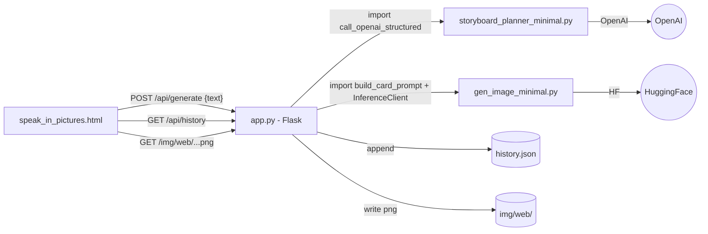

# Speak in Pictures — Demo Web Wiring

## Architecture (target)



## Hard guardrails for every phase
- Never modify [storyboard_planner_minimal.py](storyboard_planner_minimal.py) or [gen_image_minimal.py](gen_image_minimal.py). Import their functions only.
- Never start a server during implementation. Stop after edits and let the user run `python app.py`.
- Never call OpenAI or HuggingFace from implementation steps. Manual smoke test is the user's job.
- No new dependencies beyond Flask. Existing `pydantic`, `openai`, `huggingface_hub`, `Pillow` are already installed.
- All new images go to `img/web/` so the existing `img/v1`–`img/v11` test outputs remain untouched.
- Keep each phase's edits scoped to the files listed under "Files touched". Do not touch other files.

## Existing helpers we will reuse (no rewrites)
- `storyboard_planner_minimal.call_openai_structured(client, model, service_prompt, items)` returns a `StoryboardBatch` with `.items[].cards[].prompt` etc. See [storyboard_planner_minimal.py](storyboard_planner_minimal.py) lines 119-142.
- `storyboard_planner_minimal.DEFAULT_SERVICE_PROMPT` plus optional override file [service_prompt_storyboard.txt](service_prompt_storyboard.txt).
- `gen_image_minimal.build_card_prompt(service_prompt, card, add_final_reminder=True)` and `make_filename`, `slugify`, `save_image`. See [gen_image_minimal.py](gen_image_minimal.py) lines 62-122.
- `huggingface_hub.InferenceClient(api_key=...).text_to_image(prompt, model=..., width=..., height=..., num_inference_steps=...)`.
- The current static result for `sample_questions.json` lives in [storyboards.json](storyboards.json) and [img/v11/manifest.json](img/v11/manifest.json) and is the seed data for history.

## Phase 1 — Backend skeleton + serve existing v11 results

Goal: `python app.py` starts a server at `http://127.0.0.1:5000` that serves the existing HTML and returns the three pre-existing storyboards as a `/api/history` JSON. No generation yet.

What `app.py` does in this phase:
- Flask app with three routes:
  - `GET /` → serves `speak_in_pictures_demo.html` as-is.
  - `GET /img/<path>` → serves files from the project's `img/` folder (so `img/v11/...png` resolves).
  - `GET /api/history` → reads `storyboards.json` and `img/v11/manifest.json`, joins by `(source_id, card_index)`, returns:
    ```json
    {"items": [{"source_id":"lunch_01","original_text":"...","simplified_message":"...","cards":[{"card_index":1,"scene_label":"...","image_url":"/img/v11/lunch_01_c1_choose-food_67fc784ab2.png"}]}]}
    ```
- No POST routes, no generation, no `history.json` yet.

Files touched (only):
- NEW [app.py](app.py)
- UPDATE [requirements.txt](requirements.txt) (add `flask`)

Files explicitly NOT touched: [speak_in_pictures_demo.html](speak_in_pictures_demo.html), [storyboard_planner_minimal.py](storyboard_planner_minimal.py), [gen_image_minimal.py](gen_image_minimal.py).

User-runnable smoke test:
1. `pip install -r requirements.txt`
2. `python app.py`
3. Visit `http://127.0.0.1:5000/` — page loads (still emoji-based, that's expected this phase).
4. Visit `http://127.0.0.1:5000/api/history` — returns 3 items with `image_url` strings; clicking one loads a real PNG.

## Phase 2 — Render real image cards in the HTML, history strip from /api/history

Goal: the page now shows the three pre-existing storyboards using real PNGs, and the row of buttons under the textarea becomes a clickable history of the last ~10 questions (seeded from `/api/history`).

Edits to [speak_in_pictures_demo.html](speak_in_pictures_demo.html):
- On load, `fetch('/api/history')` and render the most recent up to 10 items as `<button>` chips inside the existing `.quick-buttons` container. Each button's text is the truncated `original_text`; clicking it fills `#phraseInput`, sets the meaning box from `simplified_message`, and renders cards from that history item (no network call, no generation).
- Replace the panel renderer in `generateStoryboard` so panels show `` instead of emoji `.scene` divs when `image_url` is present. Keep emoji fallback path for items with no image.
- Remove the hardcoded scenario rules and `visualVocabulary` only if they are not used elsewhere on the page; otherwise leave them as fallback for offline mode. Default policy: keep them as fallback, but the primary path is "look up by source_id in the loaded history".
- Leave the planner card (`Grandma's Picture Plan`, slots, drag/drop, `seedActivities`) untouched in this phase.

Files touched (only):
- UPDATE [speak_in_pictures_demo.html](speak_in_pictures_demo.html)

Files explicitly NOT touched: `app.py`, both Python modules.

User-runnable smoke test:
1. With `app.py` still running from Phase 1, refresh the page.
2. The history row shows three buttons (`What would you like for lunch...`, `I will be back after work.`, `Do you need to use the bathroom?`).
3. Click each — three real PNG cards render in the storyboard area.

## Phase 3 — `POST /api/generate` runs the real pipeline and persists history

Goal: typing new text and clicking *Make Storyboard* runs planner → image generator end-to-end and renders the result. The result is appended to `history.json` so it survives restarts.

`app.py` additions:
- Module-level lazy singletons for `OpenAI` and `InferenceClient`. Read keys from `OPENAI_API_KEY` and `HF_TOKEN` env vars; if missing, return HTTP 500 with a clear JSON error.
- `POST /api/generate` accepts `{"text": "..."}`, then:
  1. Calls `call_openai_structured(client, model="gpt-4o-mini", service_prompt=<file or default>, items=[{"source_id": <generated id>, "text": text}])`. Source id pattern: `web_<unix_ts>`.
  2. For each card in the single returned item: `build_card_prompt(image_service_prompt, card)`, then `client.text_to_image(prompt, model="black-forest-labs/FLUX.1-schnell", width=1024, height=1024, num_inference_steps=4)`, then `save_image(img, img/web/<filename>)` using `make_filename(source_id, card_index, reuse_key, prompt)`.
  3. Build a history record (same shape as `/api/history` items) with `image_url = "/img/web/<filename>"`.
  4. Append to `history.json` (read-modify-write; cap at most 50 entries; truncate oldest).
  5. Return the new record as JSON.
- `GET /api/history` becomes: read `history.json` (creating it on first call by seeding from existing `storyboards.json` + `img/v11/manifest.json`). Return the most recent 10 items, newest first.

Edits to [speak_in_pictures_demo.html](speak_in_pictures_demo.html):
- Wrap `generateStoryboard` so the *Make Storyboard* button does `fetch('/api/generate', {method:'POST', body: JSON.stringify({text})})`, shows a simple loading state in `#meaning`, then renders the returned cards and prepends a new chip to the history row.
- On error, show the server error message in `#meaning`.

Files touched (only):
- UPDATE [app.py](app.py)
- UPDATE [speak_in_pictures_demo.html](speak_in_pictures_demo.html)
- NEW (auto-created at runtime) `history.json`, `img/web/` directory.

Files explicitly NOT touched: both Python modules, [storyboards.json](storyboards.json), `img/v11/`.

Guardrail: `/api/generate` does not write to `storyboards.json` or any `img/vN/` folder. That history is read-only seed data.

User-runnable smoke test:
1. Set env vars `OPENAI_API_KEY` and `HF_TOKEN`.
2. Restart `python app.py`. Refresh page.
3. Type "Time for a walk before dinner." → click *Make Storyboard*.
4. Within ~30 s, real cards render. New chip appears in history row. `history.json` exists in repo root with the new record. Restart server, refresh — the chip is still there.

## Phase 4 — History click-to-recall, planner drag/drop polish, history cap

Goal: tighten the UX so the success criteria all pass cleanly.

Edits to [speak_in_pictures_demo.html](speak_in_pictures_demo.html) only:
- Cap the history row at 10 visible chips, newest first; truncate chip labels to ~30 chars.
- Clicking a history chip rerenders that item's cards from the cached history payload (no `/api/generate` call).
- Make each rendered storyboard panel `draggable=true`. On drag start, set a payload `{source_id, image_url, label}`. The existing slot drop handlers (`dropActivity`) accept either an existing `.activity-card` id (current behavior) or a new payload, in which case they synthesize a new `.activity-card` with the image thumbnail and the `simplified_message` as label.
- Update `seedActivities` to pull the first card of each of the most recent 3 history items instead of hardcoded emoji seeds.
- Keep `Save Current Activity` and `Reset Plan` working the same way.

Files touched (only):
- UPDATE [speak_in_pictures_demo.html](speak_in_pictures_demo.html)

Files explicitly NOT touched: `app.py`, both Python modules, any JSON.

User-runnable smoke test (matches your success criteria 1:1):
1. Open `http://127.0.0.1:5000/` locally.
2. The three `sample_questions.json` items appear as cards (success #2).
3. Type a new question, click *Make Storyboard*, real cards render (success #3).
4. The new question appears as a clickable chip in the history row (success #4).
5. Drag a storyboard panel into Morning/Afternoon/Evening and the image card lands in the slot (success #5).

## Out of scope (do not implement unless asked)
- Authentication, multi-user, deployment, Docker, HTTPS.
- Editing or refactoring the existing planner/image modules.
- Streaming progress, queue/jobs, retries, image regeneration UI.
- Importing additional `service_prompt_image.md` style prompts beyond the optional file load already present.
- Persisting day-plan slot assignments across refreshes.

## Summary of all files across phases
- NEW: [app.py](app.py), `history.json` (runtime), `img/web/` (runtime).
- UPDATED: [speak_in_pictures_demo.html](speak_in_pictures_demo.html), [requirements.txt](requirements.txt).
- UNCHANGED: [storyboard_planner_minimal.py](storyboard_planner_minimal.py), [gen_image_minimal.py](gen_image_minimal.py), [sample_questions.json](sample_questions.json), [storyboards.json](storyboards.json), `img/v1/`–`img/v11/`, [service_prompt_storyboard.txt](service_prompt_storyboard.txt), [service_prompt_image.md](service_prompt_image.md), [README.md](README.md), [install.ps1](install.ps1).
